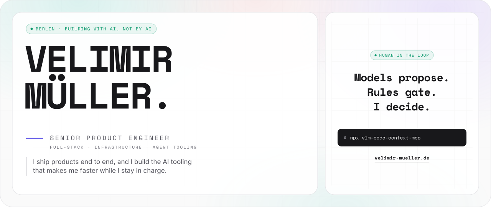
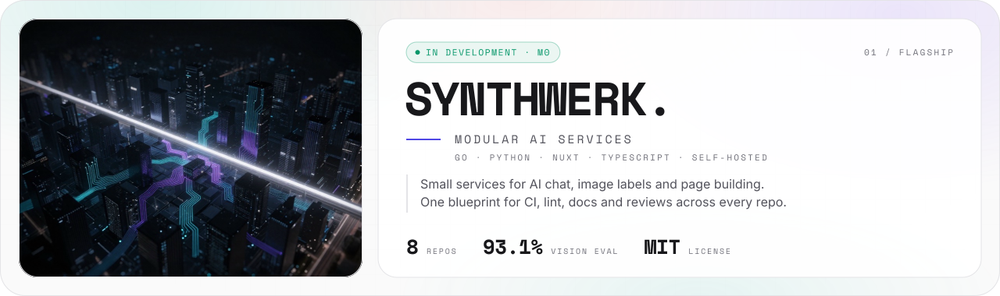
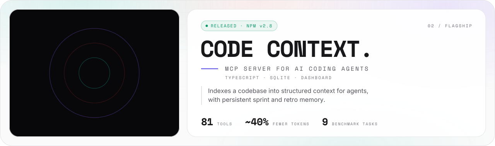

<picture>
  <source media="(prefers-color-scheme: dark)" srcset="assets/banner/hero-v1-dark.svg">
  
</picture>

<p align="center">
  <a href="https://velimir-mueller.de"></a>
  <a href="https://www.linkedin.com/in/velimir-m%C3%BCller-07b460175"></a>
  <a href="mailto:velimir.mueller@googlemail.com"></a>
</p>

I ship products end to end: requirements, UX/UI, full-stack code, cloud deployment.
Today I also build the AI tooling around that work. The models do more of the typing. I still own every decision.

```text
[ NOW    ]  senior product engineer @ galvany, berlin
[ BUILD  ]  synthwerk: modular ai services you run yourself
[ SHIPS  ]  vlm-code-context-mcp v2.8 on npm
```

```text
-- 01 ------------------------------------------------------ FLAGSHIPS --
```

<a href="https://github.com/VelimirMueller/synthwerk">
  <picture>
    <source media="(prefers-color-scheme: dark)" srcset="assets/cards/synthwerk-v1-dark.svg">
    
  </picture>
</a>

<a href="https://github.com/VelimirMueller/vlm-code-context-mcp">
  <picture>
    <source media="(prefers-color-scheme: dark)" srcset="assets/cards/code-context-v1-dark.svg">
    
  </picture>
</a>

<a href="https://github.com/VelimirMueller/portfolio-website">
  <picture>
    <source media="(prefers-color-scheme: dark)" srcset="assets/cards/portfolio-v1-dark.svg">
    
  </picture>
</a>

**Synthwerk** is one map of small services, one repo per role:

```text
  +----------+   +----------+   +----------+   +----------+
  |  STUDIO  |   | WIDGETS  |   |   SDK    |   | BLUEPRINT|
  | nuxt 4   |   | vue ce   |   | tokens   |   | ci, lint |
  +----+-----+   +----+-----+   +----+-----+   +----------+
       |              |              |          shared by all
  =====+==============+==============+=========================
       |              |              |
  +----+-----+   +----+-----+   +----+-----+
  | IDENTITY |   |   LLM    |   |  VISION  |
  | go       |   | go, sse  |   | python   |
  +----------+   +----------+   +----------+
```

| Repo | Role | Status |
|---|---|---|
| [synthwerk](https://github.com/VelimirMueller/synthwerk) | The map. Start here. |  |
| [synthwerk-vision](https://github.com/VelimirMueller/synthwerk-vision) | Open-vocabulary image labels (FastAPI, ONNX SigLIP 2) |  |
| [synthwerk-sdk](https://github.com/VelimirMueller/synthwerk-sdk) | Design tokens. Client and bindings next. |  |
| [synthwerk-blueprint](https://github.com/VelimirMueller/synthwerk-blueprint) | Shared CI, lint configs, templates |  |
| [synthwerk-llm](https://github.com/VelimirMueller/synthwerk-llm) | LLM gateway (Go) |  |
| [synthwerk-identity](https://github.com/VelimirMueller/synthwerk-identity) | Orgs, roles, entitlements on Zitadel (Go) |  |
| [synthwerk-studio](https://github.com/VelimirMueller/synthwerk-studio) | Page builder and admin (Nuxt 4) |  |
| [synthwerk-widgets](https://github.com/VelimirMueller/synthwerk-widgets) | Embeddable chat and vision widgets |  |

```text
-- 02 ------------------------------------------------------- THE RIG --
```

Most of my tooling is private. This is how it works, at a high level.

```text
  +--------+    +--------+    +-----------+    +-----------+    +------+
  | TICKET |--->|  SPEC  |--->| IMPLEMENT |--->| 2 REVIEWS |--->| SHIP |
  |  me    |    | model  |    |  models   |    | both must |    |  me  |
  |        |    | + me   |    |           |    |  approve  |    |      |
  +--------+    +--------+    +-----------+    +-----------+    +------+
                                                     |
       a model can flag a risk, it cannot clear one  |
       a missing reviewer means BLOCKED, not skipped v
                                               +-----------+
                                               |  MEMORY   |
                                               |  lessons  |
                                               +-----------+
```

- **Gated reviews.** Two independent models review every change. Both must approve before a PR opens.
- **Deploy verdicts by rules.** A release check reads the merged PRs and gives GO or HOLD. Fixed rules decide the verdict. A model writes the release notes, never the verdict.
- **Memory that outlives a session.** A local knowledge base keeps decisions, pitfalls and dependencies. Every new session starts from it.
- **Local first.** Image generation, document creation and code search run on my machine.
- **One versioned setup.** The whole rig is pinned, logged and health-checked with one command.

> I use AI to go faster, not to stop thinking.
> Every tool in my rig proposes. None of them merges, deploys or closes a ticket on its own.
> When a model and a rule disagree, the rule wins. When they agree, I still read the diff.

```text
-- 03 ---------------------------------------------------------- WORK --
```

**GALVANY** · Senior Software Engineer, Full-Stack / Product · Feb 2025 to now

- I own product engineering end to end at a hyper-growth energy startup.
- I built a lead management platform. Assignment time dropped by 3 to 4 times.
- I built a scoring engine for lead-seller matching. Predicted conversion rose from about 6 % to 11 %.
- Laravel, React, TypeScript, Terraform on AWS and Azure. Unit, E2E and visual regression tests.
- The code is private. The case studies are on [velimir-mueller.de](https://velimir-mueller.de).

```text
-- 04 --------------------------------------------------- ALSO BUILT --
```

| Project | What |
|---|---|
| [claude_development_skills](https://github.com/VelimirMueller/claude_development_skills) | Opinionated, audit-aware Claude Code skills for frontend projects |
| [cyberpunk_arcade_shooter](https://github.com/VelimirMueller/cyberpunk_arcade_shooter) | Arcade shooter in Rust and Bevy. Runs as WASM on my site. |
| [langchain_debater](https://github.com/VelimirMueller/langchain_debater) | Multi-role debate agent on LangGraph, traced in LangSmith and Langfuse |

```jsonc
// stack.json
{
  "frontend":  ["Next.js", "React", "Vue 3", "Nuxt", "TypeScript", "Tailwind CSS"],
  "backend":   ["Node.js", "Go", "FastAPI", "Laravel", "Quarkus"],
  "languages": ["TypeScript", "Python", "Go", "PHP", "Kotlin", "Rust"],
  "platform":  ["Vercel", "Supabase", "AWS", "Azure", "Terraform", "Docker"],
  "testing":   ["Vitest", "Jest", "Playwright", "Pytest", "visual regression"],
  "ai":        ["Claude Code", "MCP", "LangGraph", "ONNX", "local models on MLX"]
}
```

```text
 ██  ██  ██   ██
 ██  ██  ███ ███
 ██  ██  ███████
  ████   ██ █ ██
   ██    ██   ██  ██

 berlin. building with ai, not by ai.
```
