<picture>
  <source media="(prefers-color-scheme: dark)" srcset="assets/banner/hero-v2-dark.svg">
  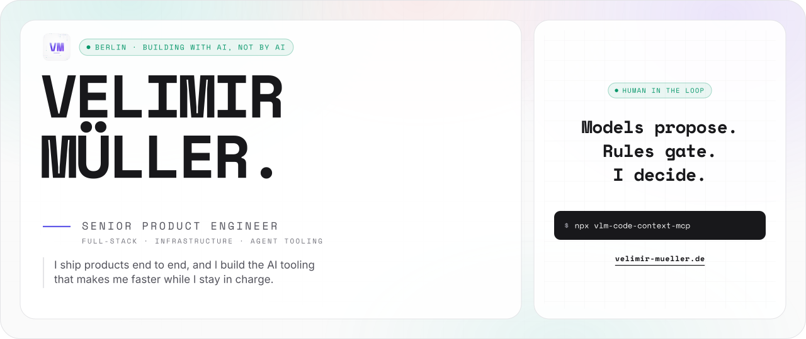
</picture>

<p align="center">
  <a href="https://velimir-mueller.de"></a>
  <a href="https://www.linkedin.com/in/velimir-m%C3%BCller-07b460175"></a>
  <a href="mailto:velimir.mueller@googlemail.com"></a>
</p>

```text
██  ██  ██████  ██      ██████  ██   ██  ██████  █████
██  ██  ██      ██        ██    ███ ███    ██    ██  ██
██  ██  █████   ██        ██    ███████    ██    █████
 ████   ██      ██        ██    ██ █ ██    ██    ██ ██
  ██    ██████  ██████  ██████  ██   ██  ██████  ██  ██  ██
```

<picture>
  <source media="(prefers-color-scheme: dark)" srcset="assets/readme/stats-v3-dark.svg">
  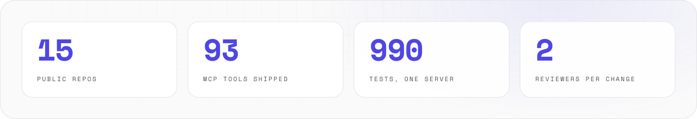
</picture>

<br>


I ship products end to end: requirements, UX/UI, full-stack code, cloud deployment.
Today I also build the AI tooling around that work. The models do more of the typing. I still own every decision.

<picture>
  <source media="(prefers-color-scheme: dark)" srcset="assets/panels/capabilities-v1-dark.svg">
  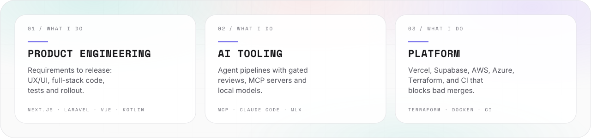
</picture>

<picture>
  <source media="(prefers-color-scheme: dark)" srcset="assets/readme/now-v3-dark.svg">
  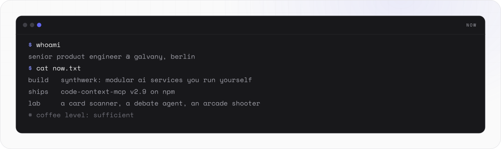
</picture>

<br>


<a href="https://github.com/VelimirMueller/synthwerk">
  <picture>
    <source media="(prefers-color-scheme: dark)" srcset="assets/cards/synthwerk-v2-dark.svg">
    
  </picture>
</a>

<a href="https://github.com/VelimirMueller/code-context-mcp">
  <picture>
    <source media="(prefers-color-scheme: dark)" srcset="assets/cards/code-context-v2-dark.svg">
    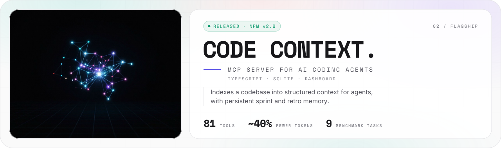
  </picture>
</a>

<a href="https://github.com/VelimirMueller/portfolio-website">
  <picture>
    <source media="(prefers-color-scheme: dark)" srcset="assets/cards/portfolio-v2-dark.svg">
    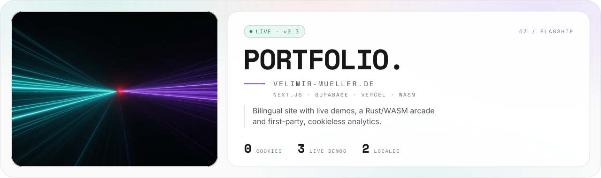
  </picture>
</a>

<br>

**Synthwerk** is one map of small services, one repo per role:

<picture>
  <source media="(prefers-color-scheme: dark)" srcset="assets/panels/synthwerk-map-v1-dark.svg">
  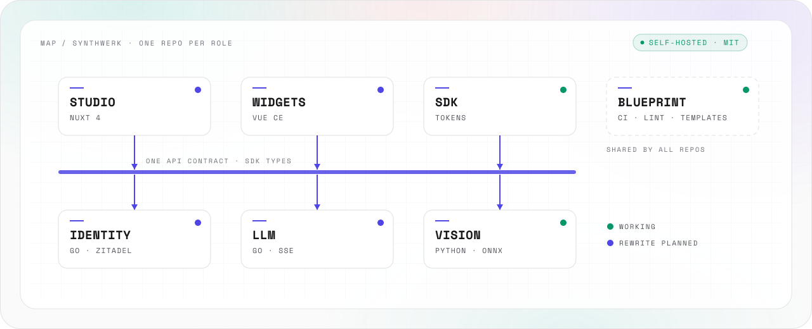
</picture>

<picture>
  <source media="(prefers-color-scheme: dark)" srcset="assets/readme/synthwerk-v3-dark.svg">
  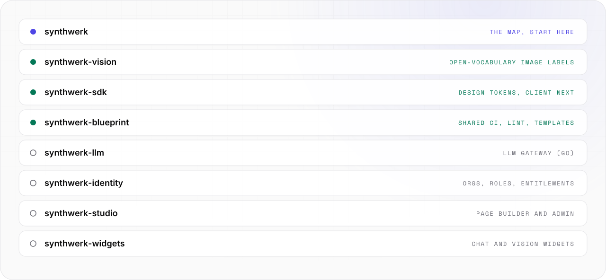
</picture>

Repos: [synthwerk](https://github.com/VelimirMueller/synthwerk) · [vision](https://github.com/VelimirMueller/synthwerk-vision) · [sdk](https://github.com/VelimirMueller/synthwerk-sdk) · [blueprint](https://github.com/VelimirMueller/synthwerk-blueprint) · [llm](https://github.com/VelimirMueller/synthwerk-llm) · [identity](https://github.com/VelimirMueller/synthwerk-identity) · [studio](https://github.com/VelimirMueller/synthwerk-studio) · [widgets](https://github.com/VelimirMueller/synthwerk-widgets)

<br>


Most of my tooling is private. This is how it works, at a high level.

<picture>
  <source media="(prefers-color-scheme: dark)" srcset="assets/panels/rig-v1-dark.svg">
  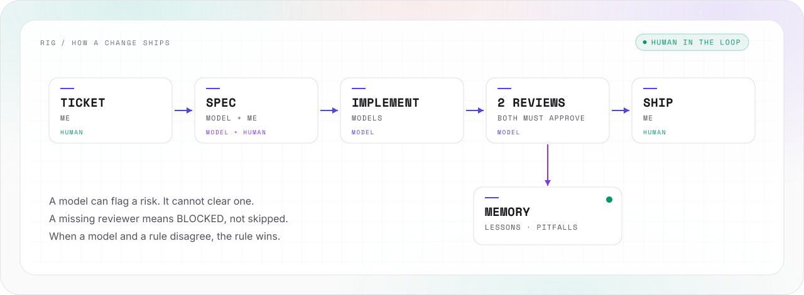
</picture>

**Ops** is the group of private repos behind this rig:

<picture>
  <source media="(prefers-color-scheme: dark)" srcset="assets/readme/ops-v3-dark.svg">
  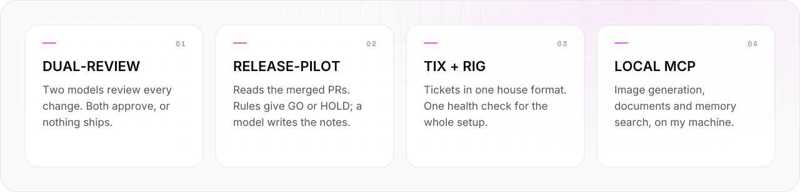
</picture>

<picture>
  <source media="(prefers-color-scheme: dark)" srcset="assets/readme/opsstats-v3-dark.svg">
  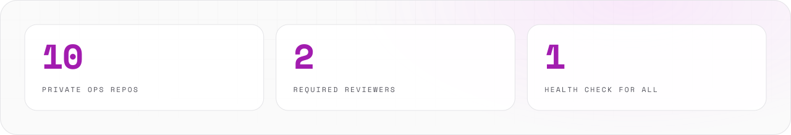
</picture>

- **Gated reviews.** Two independent models review every change. Both must approve before a PR opens.
- **Deploy verdicts by rules.** A release check reads the merged PRs and gives GO or HOLD. Fixed rules decide the verdict. A model writes the release notes, never the verdict.
- **Memory that outlives a session.** A local knowledge base keeps decisions, pitfalls and dependencies. Every new session starts from it.
- **Local first.** Image generation, document creation and code search run on my machine.
- **One versioned setup.** The whole rig is pinned, logged and health-checked with one command.

<br>

> I use AI to go faster, not to stop thinking.
> Every tool in my rig proposes. None of them merges, deploys or closes a ticket on its own.
> When a model and a rule disagree, the rule wins. When they agree, I still read the diff.

<br>


**GALVANY** · Senior Software Engineer, Full-Stack / Product · Feb 2025 to now

- I own product engineering end to end at a hyper-growth energy startup.
- I built a lead management platform. Assignment time dropped by 3 to 4 times.
- I built a scoring engine for lead-seller matching. Predicted conversion rose from about 6 % to 11 %.
- Laravel, React, TypeScript, Terraform on AWS and Azure. Unit, E2E and visual regression tests.
- The code is private. The case studies are on [velimir-mueller.de](https://velimir-mueller.de).

<br>


<picture>
  <source media="(prefers-color-scheme: dark)" srcset="assets/readme/lab-v3-dark.svg">
  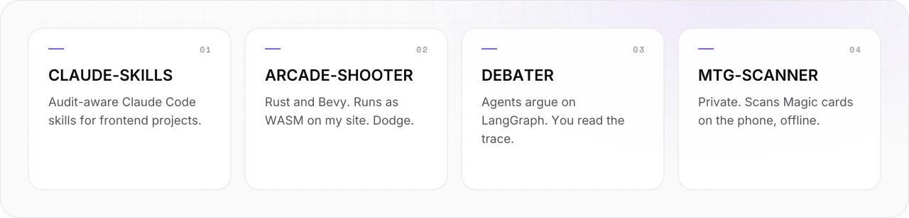
</picture>

Repos: [lab-claude-skills](https://github.com/VelimirMueller/lab-claude-skills) · [lab-arcade-shooter](https://github.com/VelimirMueller/lab-arcade-shooter) · [lab-debater](https://github.com/VelimirMueller/lab-debater)

<br>

<picture>
  <source media="(prefers-color-scheme: dark)" srcset="assets/readme/stack-v3-dark.svg">
  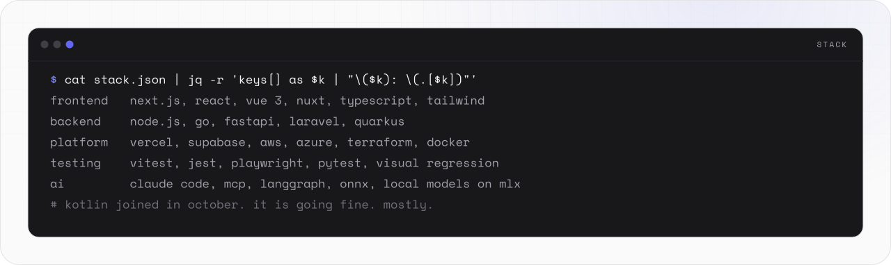
</picture>

<br>

```text
-- EOF ------------------------------------------- THANKS FOR READING --
```

<p align="center">
  <picture>
    <source media="(prefers-color-scheme: dark)" srcset="assets/logo/vm-logo-v1-dark.svg">
    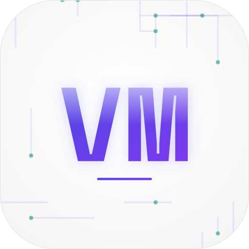
  </picture>
</p>

<p align="center">
  <sub><b>Velimir Müller</b> · Senior Product Engineer · Berlin<br>
  <a href="https://velimir-mueller.de">velimir-mueller.de</a> · building with AI, not by AI</sub>
</p>
